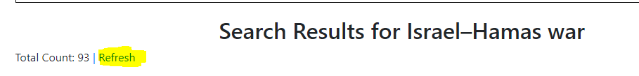

# news-portal
Basic Django Application

# Setup
1. Clone the repo
2. cd to folder news-portal,run: cd news-portal
3. Create python virtual environment, run: python -m venv venv
4. Activate venv, run: venv\Scripts\activate
5. install requirements from requirements.txt, run: pip install -r requirements.txt
6. set env varibale,
   a. API_BASE_URL='https://newsapi.org/v2'
   b. API_KEY=(your API key)

# Steps to run application
1. make migrations , run: python manage.py makemigrations
2. migrate (Apply database changes), run: python manage.py migrate
3. create superuser or admin, run:python manage.py createsuperuser
4. run application, run: python manage.py runserver
5. visit: http://127.0.0.1:8000/

* run above mentioned in windows cmd.

# References
1. https://docs.djangoproject.com/en/4.2/
2. https://django-filter.readthedocs.io/en/stable/guide/usage.html#declaring-filters
3. https://newsapi.org/docs

# Approx time
Aprrox time take to build this project: 10-15 hrs.

# Future Score
1. UI/UX
2. Show the original news page in the same window.
3. Background job to automatically refresh search results 
4. Customise Admin panel

# Documentation

1. Signup new user here, http://127.0.0.1:8000/signup/

2. After that you will be redirect to Login page, http://127.0.0.1:8000/login/

3. You can visit the search portal, http://127.0.0.1:8000/search/

4. fill the data and search, keyword field is required, others are optional
eg: 

5. After search, you will get search data like this on same page, On which you can apply filters.

    Note: If you search for same keywords within the 15 min from last search, you will get he same data, You can refresh if you want to get new data.
6 Also you can refresh the result by clicking on Refresh 

7 Watch search history here, http://127.0.0.1:8000/search_history/, you can delete/clear or view histroy detials.

8. Admin panel, http://127.0.0.1:8000/admin/

9. Logout
